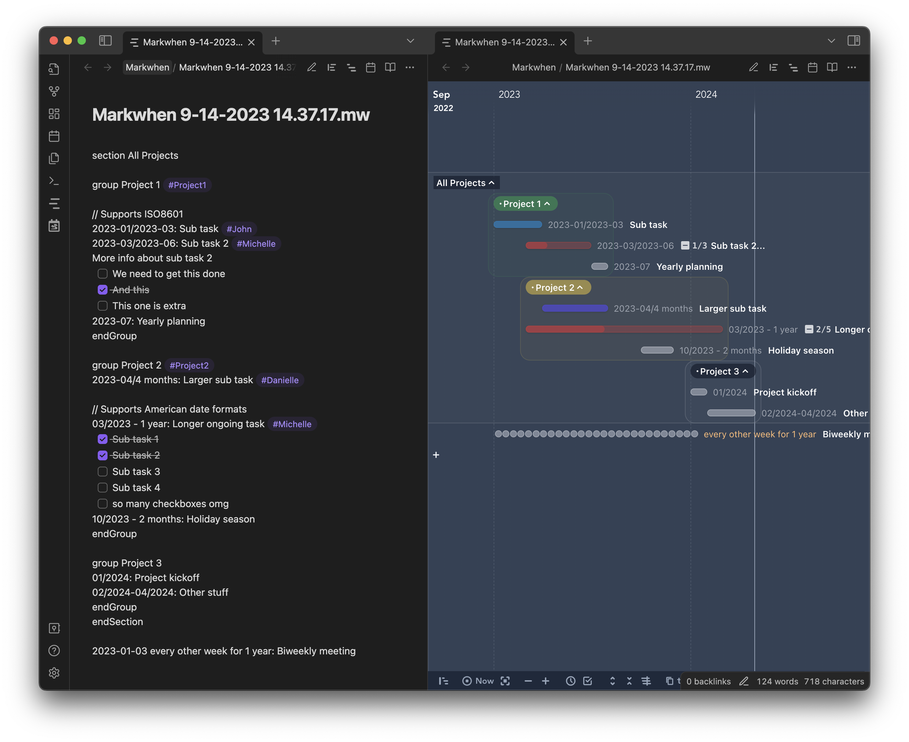

# Obsidian Markwhen




This plugin integrates [Markwhen](https://github.com/mark-when/markwhen/) into [Obsidian.md](https://obsidian.md/). You can use markwhen syntax to create timelines.

> **Note**  
> Latest release: NaN  
> Document version: developer

## Development

Ensure you first have Obsidian installed. If the path to your vault is something other than `~/Documents/Obsidian Vault`, update `copyAssets.sh` to point to your vault's location.

```sh
git clone git@github.com:mark-when/obsidian-plugin.git
cd obsidian-plugin
npm i
npm run vite
```

## Installation

> **Note**  
> Make sure that you are not in the **Restricted Mode**.

The plugin is in active deveplopment.

### Install the plugin manually

1. Go to the repo's latest [release page](https://github.com/mark-when/obsidian-plugin/releases/latest), and download `obsidian-markwhen.zip`.
2. Copy these files to your local path `[yourvault]/.obsidian/plugins/`.
3. Launch/restart Obsidian, or refresh the plugin list, you will see this plugin.
4. In the plugin list, enable `Markwhen` and enjoy!

### Building the plugin from source code

Check our [contributing instructions](CONTRIBUTING.md).
